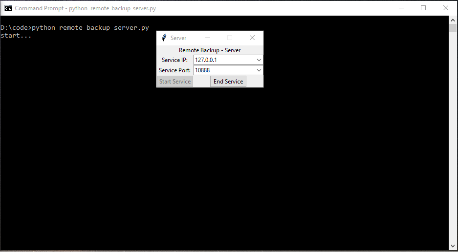
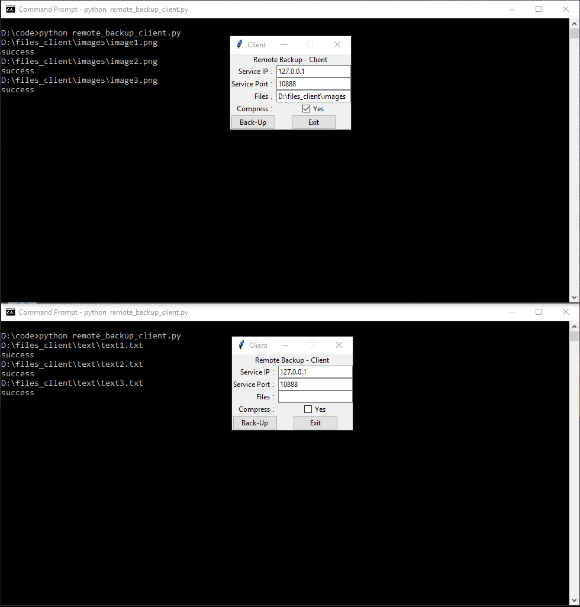
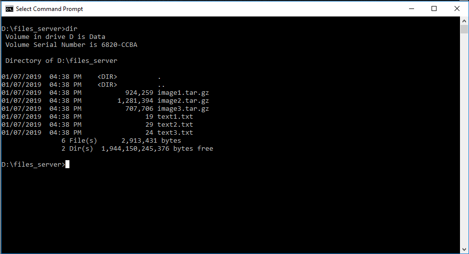

# Remote File Backup Application 
### Description
This is a simple application that enables remote file backup on a server.

### Highlights
1. Start the server


2. Multi-user access (first user enabled compression)


3. Backup files on the server


###  Build
```sh
python remote_backup_server.py
python remote_backup_client.py
```